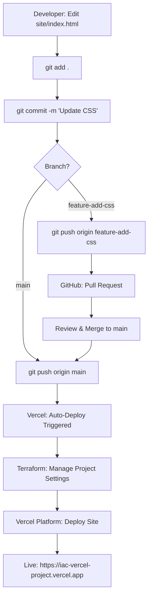
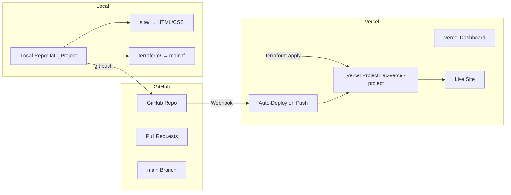

# Version Control Practices on IaC Project

## Overview
This B.Tech project demonstrates **Infrastructure as Code (IaC)** using **Terraform** to manage a Vercel project and **Git** for version control, with automatic deployments via Vercel’s Git integration to host a static website. The website is a simple HTML/CSS page (e.g., a portfolio) hosted at `https://iac-vercel-project.vercel.app`. The project follows version control best practices to ensure a clean, collaborative, and secure workflow, suitable for a DevOps pipeline.

Initially, I attempted to deploy the site entirely with Terraform, but due to persistent file parsing issues in the Vercel Terraform provider (v3.x), I used the Vercel CLI (`vercel --prod`) as a fallback. Now, deployments are automated by pushing to the GitHub repository’s `main` branch.

## Live Demo
Visit my deployed website at: [https://iac-vercel-project.vercel.app](https://iac-vercel-project.vercel.app)

## Version Control Best Practices
I implemented the following best practices for IaC with Git:
1. **Git Tracking**: All code is versioned in a Git repository on GitHub.
2. **Organized Structure**: Files are organized in `site/` (HTML/CSS) and `terraform/` (IaC).
3. **Branching Strategy**: Used a `feature-add-css` branch for CSS updates, merged via pull requests.
4. **Clear Commit Messages**: Descriptive commits, e.g., "Updated Terraform to include Git repository integration."
5. **No Secrets**: Vercel API token stored in environment variables, not in Git.
6. **Documentation**: This README and an architecture diagram explain the project.
7. **State Management**: Excluded `terraform.tfstate`, `.terraform.lock.hcl`, and other sensitive files in `.gitignore`.

## Project Workflow
Below is an ASCII diagram of the project workflow, showing how I write, version, and deploy the site:



## Architecture Diagram
The architecture diagram below visualizes the IaC workflow for deploying the static website, following standard diagramming conventions (rectangles, straight arrows, clear labels):

For GitHub rendering, here’s the Mermaid code:



This flowchart shows the workflow: edit files (`site/`, `terraform/`), manage version control with Git/GitHub, use Terraform for Vercel project settings (`iac-vercel-project`), and trigger automatic deployments to Vercel (`https://iac-vercel-project.vercel.app`) by pushing to `main`.


## Setup Instructions
To replicate this project, you need **Git**, **Terraform**, **Node.js**, and a free Vercel account with GitHub integration.

### Prerequisites
1. Install tools:
   - Git: [git-scm.com](https://git-scm.com)
   - Terraform: [terraform.io/downloads](https://www.terraform.io/downloads)
   - Node.js: [nodejs.org](https://nodejs.org) (LTS, optional for manual CLI fallback)
2. Connect your GitHub repository to Vercel:
   - In Vercel dashboard > New Project, import `yourusername/iac-vercel-project`.
   - Set `site/` as the root directory and `main` as the production branch.
3. Clone the repository (replace `yourusername` with your GitHub username):
   ```bash
   git clone https://github.com/yourusername/iac-vercel-project.git
   cd iac-vercel-project
   ```

### Terraform Setup
1. Set the Vercel API token (replace with your token from Vercel dashboard > Settings > Tokens):
   ```powershell
   # PowerShell
   $env:TF_VAR_vercel_api_token = "your-vercel-api-token"
   ```
2. Initialize and apply Terraform to configure the project:
   ```powershell
   cd terraform
   terraform init
   terraform apply
   ```
   Type `yes` to configure the Vercel project (`iac-vercel-project`) with Git integration.

### Deploy the Website
1. **Automatic Deployment**:
   - Push changes to the `main` branch to trigger a Vercel deployment:
     ```powershell
     git add .
     git commit -m "Updated site files"
     git push origin main
     ```
   - Check Vercel dashboard > Deployments for the new deployment (takes 1-2 minutes).
   - Visit `https://iac-vercel-project.vercel.app` to verify.

2. **Manual Deployment (Fallback)**:
   - If automatic deployment fails, use Vercel CLI:
     ```powershell
     cd site
     vercel --prod
     ```
   - Select the `iac-vercel-project` project when prompted.

### Make Changes
1. Create a feature branch:
   ```powershell
   git checkout -b feature-update
   ```
2. Edit files in `site/` (e.g., `index.html`, `style.css`).
3. Commit and push:
   ```powershell
   git add site/
   git commit -m "Updated site with new styles"
   git push origin feature-update
   ```
4. Create a pull request on GitHub, review, and merge to `main`.
5. Vercel automatically deploys the merged changes to `https://iac-vercel-project.vercel.app`.


## Troubleshooting
- **Issue**: Terraform `vercel_deployment` failed with "Could not parse files" error.
  - **Fix**: Switched to Vercel CLI and Git integration due to provider limitations. Simplified Terraform to manage project settings with `framework = null`.
- **Issue**: Vercel CLI failed with "react-scripts: command not found."
  - **Fix**: Added `site/vercel.json` to disable builds and set `framework = null` in Terraform.
- **Issue**: CSS changes not visible.
  - **Fix**: Ensured `style.css` is linked/included in `index.html` and included in `site/`. Pushed to `main` or redeployed with `vercel --prod --force`.
- **Issue**: Automatic deployment not triggering.
  - **Fix**: Verify GitHub integration in Vercel dashboard > Settings > Git. Ensure `site/` is the root directory and `main` is the production branch.

## Project Learnings
This project taught me:
- How to use Terraform for IaC to manage Vercel project settings with Git integration.
- Git best practices for version control (branching, clear commits, no secrets, documentation).
- Vercel’s Git integration for automatic static site deployments.
- Debugging Terraform provider issues and using CLI/Git integration as a workaround.

For issues, check the Vercel dashboard (Projects > iac-vercel-project > Deployments) or run `vercel --debug`. Contact me via GitHub for help!